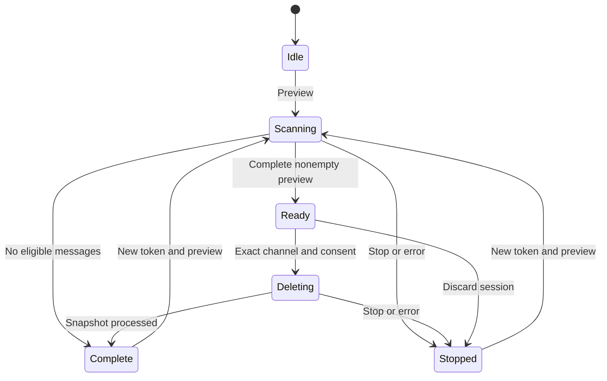

# Architecture

## Trust boundaries

| Module | Responsibility | Credential access |
| --- | --- | --- |
| `content.js` | Closed-shadow launcher; extension iframe; current-channel/visibility bridge | None |
| `background.js` | Toolbar toggle; trusted storage access level | None |
| `panel.html` / `panel.js` | Extension-origin input fields; opt-in persistence; status; explicit confirmation | Masked input/private remembered value; passes token directly to engine |
| `core/wiper.js` | Verified author, pagination, frozen candidate IDs, state transitions | Constructs private client; no public token property |
| `core/discordClient.js` | Fixed Discord endpoints, serialized requests, cooldown/retry policy | Private `#token`; Authorization header only |
| `core/control.js` | Pause checkpoints; abortable waits and fetch signal | None |
| `core/sessionLease.js` | Exclusive extension-origin Web Lock | None |
| `core/preferences.js` | Explicit allowlist for persisted settings | None |
| `core/tokenStore.js` | Trusted local credential access; queued saves/removal; conditional rejection cleanup | Opted-in saved token only |
| `core/pacing.js` | Balanced/faster presets and allowed delay range | None |
| `core/filters.js` | Frozen date/word/pin/attachment rules; metadata validation; literal matching | None |
| `core/dateScan.js` | Exact BigInt date boundaries and nonempty scan windows | None |
| `core/runMetrics.js` | Injected-clock elapsed time, observed progress, and remaining-time estimates | None |

The iframe shares an extension origin with other instances of this extension, not Discord. Only its bundled scripts execute there. CSP restricts connections to `https://discord.com` and forbids remote/inline scripts, objects, form navigation, and unrelated framing origins. The parent bridge validates both origin and source, plus a per-frame ID, and carries only channel IDs and visibility messages. There is no network proxy or deletion command exposed to Discord's page.

## State transitions



Pause is an orthogonal flag while scanning/deleting. It blocks the next request and every delay checkpoint; it does not claim to cancel a request already sent. Stop aborts the shared signal, wakes paused checkpoints, disposes the client, and discards candidates. Cooldowns are timestamps, so a pause never resets or shortens them.

The session Web Lock spans scanning, paused work, preview confirmation, and deletion. It releases on completion, stop/error, or page destruction. This avoids competing instances in the same extension storage partition. Separate profiles/partitions and other Discord API clients cannot be coordinated by this extension.

Token storage is independent of the engine. It is off by default; only explicit remembering writes the `wiperSavedToken` entry. Every credential operation first enforces `TRUSTED_CONTEXTS`, uses an ordered local promise queue, and uses a separate Web Lock when available. Save followed by Forget cannot leave a late save queued behind the removal. Conditional `401` cleanup checks the stored value before deleting it, preserving newer replacements. Credentials are not encrypted by this extension, synced, logged, bridged to the page, or included in preference serialization.

Stop ends the engine session and retains an opted-in credential. Forget also removes the stored entry and clears this panel's remembered input; other already-open panels may retain in-memory credentials. Loading a saved token does not start work. Core integrations must handle persistence/Forget themselves; `MessageWiper` owns only the active client token and snapshot.

## Core usage

The UI is one consumer of independently testable modules:

```js
import { MessageWiper } from "./core/wiper.js";

const wiper = new MessageWiper({
  onChange: state => renderStatus(state),
  onLog: (message, level) => appendActivity(message, level)
});

const previewTask = wiper.preview({
  token: tokenInput.value,
  channelId: channelInput.value,
  minDelay: 1000,
  maxDelay: 2000,
  filters: {
    dateEnabled: true, dateMode: "during", dateFrom: "2026-10-01", dateTo: "2026-10-04",
    wordEnabled: true, wordMode: "excluding", wordQuery: "keep this\nimportant",
    wordMatch: "any", wholeWords: true, keepPinned: true,
    attachmentEnabled: true, attachmentMode: "excluding", attachmentType: "image"
  }
});
tokenInput.value = "";
await previewTask;

// Call only after the user confirms the exact channel and permanent deletion.
await wiper.deletePreview({ channelId: confirmedChannelId, acceptRisk: true });
```

`preview()` and `deletePreview()` return a Promise of sanitized state and reject on failure/abort. `state` returns counts, verified IDs, phase, pause/wait/error details, filter summary, `dateOptimized`, and timing metrics. `filtered` counts otherwise-eligible own messages fetched but excluded by filters; `skipped` counts unsupported own types. `kept` counts candidates pinned when rechecked. State never returns tokens, message content, search terms, attachment filenames, or candidate IDs. `pause()` / `resume()` are synchronous; `stop()` resolves after active work settles. Only a full successful preview is eligible for deletion.

The panel separately enforces the risk acknowledgement and Web Lock. Integrations that reuse the core must supply equivalent UI confirmation, safe credential entry, and session exclusion. Never run deletion on an untrusted page's behalf.

## Pagination and ownership

1. GET `/users/@me` establishes the token's actual author ID. It is never inferred from token contents or supplied as an editable author filter.
2. GET `/channels/{channelId}` validates the target.
3. GET `/channels/{channelId}/messages?limit=100`, with an initial date-derived `before` when needed.
4. Validate IDs, channel, author ID, page uniqueness, backward progress, and descending order for date optimization.
5. Keep known-deletable non-webhook messages from the verified author, apply all enabled constraints with AND, and retain IDs only.
6. Continue with `before={oldestId}` using BigInt. An empty page ends accessible history; a short page or page without matches does not. A date lower boundary ends that window.
7. Except jumps into the older window after finishing the newer one. If the boundary page already returned older matches, start below its oldest ID to avoid duplicates and omissions.
8. After confirmation, revalidate `/users/@me`. If pin protection is enabled, GET each candidate, verify its ID/channel/owner/type/pin status, then keep it if pinned or count it absent for code `10008`. Otherwise DELETE each frozen candidate individually, with a pause/stop checkpoint between the pin read and DELETE.

There is a 100,000-candidate memory cap. Exceeding it clears the preview and stops without offering partial deletion. Messages arriving after the preview are not candidates. A deleted cursor still works as a snowflake boundary, and deletion never offsets pagination because all scanning precedes it.

## Filter contract

Filters are omitted/off by default. `preview()` synchronously validates and copies enabled options into a frozen private object before any API request. `dateEnabled`, `wordEnabled`, `wholeWords`, `keepPinned`, and `attachmentEnabled` must be booleans when supplied. Invalid enabled modes, missing/impossible/reversed dates, empty/oversized terms, and invalid attachment types are rejected. Disabled value fields are ignored. Caller mutations cannot alter active options.

Date modes are `before`, `after`, `during`, and `except`. Before matches timestamps less than the selected day's local start; After matches timestamps at or after the next local day's start. During uses `[fromDayStart, dayAfterThroughStart)`, and Except is its complement. Calendar arithmetic, not a fixed 24-hour duration, handles daylight-saving transitions. Timestamps come from `(BigInt(message.id) >> 22n) + 1420070400000n`, with the 64-bit range checked when dates are used.

`dateScanRanges()` maps local calendar bounds to exclusive cursor boundaries using `(milliseconds - 1420070400000n) << 22n`, with low bits zero. Bounds clamp to `[0, 2^64]`; empty windows issue no history requests, although account/channel verification still occurs. Before/During start at an upper bound, After/During stop when the oldest fetched ID crosses the lower bound, and Except has two windows in newest-to-oldest order. Every fetched own candidate still passes the exact date predicate. Scanned/filtered counts exclude skipped history.

Word modes are `containing`/`excluding`, with `wordMatch: "any"` (default) or `"all"`. `wordQuery` contains up to 32 newline-separated trimmed terms of 1–256 characters, within an 8,256-character input limit. Blank lines are removed and lowercase-equivalent terms deduplicated into frozen arrays. Matching uses lowercase literal text on `message.content` only; Excluding negates the aggregate Any/All rule. `wholeWords` optionally checks surrounding Unicode letters/marks/numbers/underscores as word characters. Empty string content is valid; missing/non-string content discards an enabled word-filter preview. Attachment names and embeds do not participate.

`keepPinned` requires boolean preview pin metadata. Protected messages never enter the candidate list. Each retained candidate is read again immediately before deletion; missing messages return null only for `404` code `10008`, newly pinned ones increment `kept`, and unverifiable metadata stops the run. All reads share the existing pacing/cooldown/retry policy. No atomic pin-check-and-delete operation exists; a later change between requests remains possible.

Attachment modes are `containing`/`excluding`; types are `any`, `image`, `video`, `audio`, and `file`. Enabled filtering requires an attachments array and valid filename/optional string `content_type` for every attachment. Recognized media MIME prefixes take precedence over filename extensions; known extensions provide fallback and unrecognized types become other files. Containing requires at least one selected type; Excluding negates that test. Embedded links are excluded and attachment URLs are never fetched. Malformed relevant metadata discards the preview.

The panel owns values and shows frozen terms in confirmation through `textContent`. Controls lock for the session. All filters start off on a new panel/reload; hiding the same panel preserves values. Preferences exclude every filter value. Deletion consumes the original IDs without reevaluating edited words/attachments or expanding the selection. Only pin status is rechecked when protection is enabled.

## Timing contract

`RunMetrics` uses an injected clock. `elapsedMs` is wall time since Preview, including pauses/confirmation, frozen at session end. `activeMs` belongs to the current/last phase, excludes pauses, and includes pacing, cooldowns, and retries. Preview ends its phase when ready; deletion starts a new phase. `messagesPerMinute` uses `deleted + alreadyGone + kept` over active deletion time and is null until progress is observable.

`remainingMs` is null for preview/confirmation and the first two processed candidates. After three, it estimates remaining count times observed average time, with a floor for any known current wait plus the other messages' average time. Complete deletion returns zero; stopped/error returns null. Paused remaining time describes active work after resuming, not the unknown manual pause duration. State reads recalculate metrics so the panel's 250 ms status timer continues through waits, pauses, and confirmation. Timing is never persisted.

## HTTP policy

| Response | Action |
| --- | --- |
| GET `200` + valid JSON | Continue |
| DELETE `204` | Count successful deletion |
| `X-RateLimit-Remaining: 0` + timing | Delay all requests until reset |
| `429` | Longest valid Retry-After, JSON retry_after, reset-after, or reset-epoch; add 250 ms margin; increase adaptive pacing; retry same request |
| `429` without timing | 5 s exponential fallback capped at 60 s; bounded retries |
| Global `429` | Same barrier for the entire session |
| `401` / `403` | Stop immediately; clear token and candidates |
| Verification challenge | Stop; no automatic solving or bypass |
| DELETE or pin-check GET `404`, code `10008` | Count already absent; continue without another DELETE |
| Other `4xx` | Stop; no retry |
| Network / timeout / `5xx` | Up to three retries with increasing waits |
| More than six `429` retries | Stop and require a fresh session |
| Invalid/unexpected success payload | Stop rather than assume success |

Server timings are seconds and may be fractional. Retry-After HTTP dates are also handled. Absolute reset timestamps supplement reset-after values conservatively. A request deadline is 30 seconds, including body decoding. Waits longer than a minute are split into abortable minute segments; this is a responsiveness detail, not a shorter cooldown.

The client uses a deliberately conservative session-wide barrier even for per-route limits. No parallel deletion, header spoofing, anti-detection logic, CAPTCHA handling, or request-limit bypass is implemented. User-selected delays add pacing and never override a longer Discord cooldown.

Balanced is 1,000–2,000 ms; Faster is 500–750 ms; custom values span 250–60,000 ms. A `429` raises the adaptive floor to at least twice the requested minimum, then doubles it on subsequent rate limits up to 60 seconds. Five successful responses halve the floor until it returns to the selected range. Every slot uses the longest of requested/adaptive pacing and advertised cooldowns. The UI shows Adaptive pacing while that floor is the controlling wait.

## Verification

Automated tests use mocked Discord responses and fictional IDs/tokens. Panel-flow tests execute the actual panel module with mocked DOM/storage/clock surfaces, including combined rules, pin preservation, confirmation, defaults/locking, and timing. Core tests cover Any/All/whole-word semantics, attachment categories and malformed metadata, late pins/ownership/stop/pause, date-window equivalence and request savings, low-bit boundaries, overlap deduplication, daylight-saving changes, and timer/cooldown accounting. They do not verify browser rendering or Chrome security boundaries. The separate browser smoke test loads the Manifest V3 package with intercepted Discord fixtures and covers the extension iframe, responsive layouts, and cross-tab Web Lock. Mocked tests cannot guarantee production user-token compatibility or Discord enforcement.
