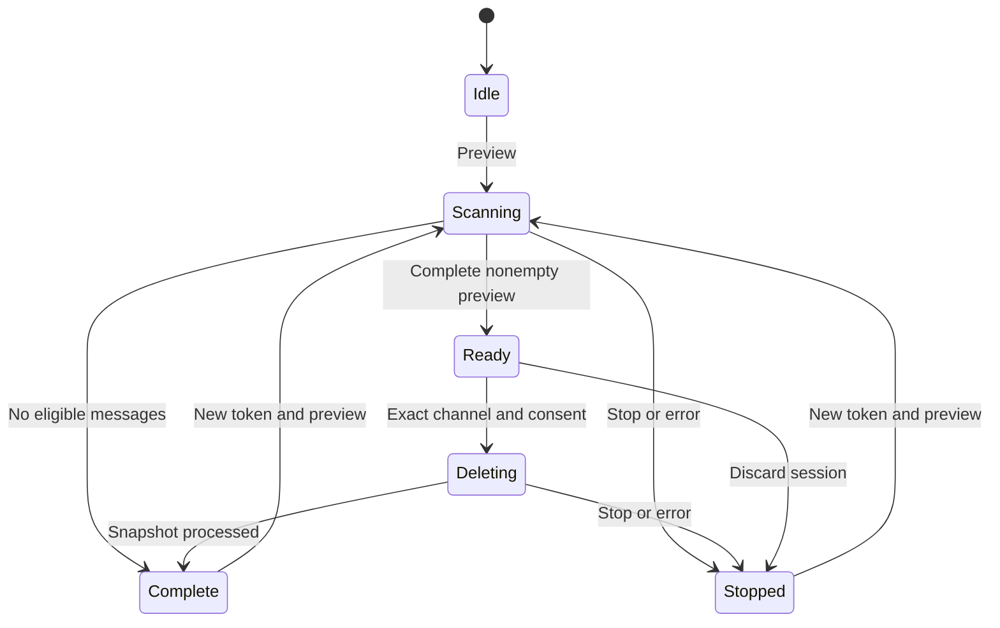

# Architecture

## Trust boundaries

| Module | Responsibility | Credential access |
| --- | --- | --- |
| `content.js` | Closed-shadow launcher; extension iframe; current-channel/visibility bridge | None |
| `background.js` | Toolbar toggle; trusted storage access level | None |
| `panel.html` / `panel.js` | Extension-origin input fields; opt-in persistence; status; explicit confirmation | Masked input/private remembered value; passes token directly to engine |
| `core/wiper.js` | Verified author, pagination, frozen candidate IDs, state transitions | Constructs private client; no public token property |
| `core/discordClient.js` | Fixed Discord endpoints, serialized requests, cooldown/retry policy | Private `#token`; Authorization header only |
| `core/control.js` | Pause checkpoints; abortable waits and fetch signal | None |
| `core/sessionLease.js` | Exclusive extension-origin Web Lock | None |
| `core/preferences.js` | Explicit allowlist for persisted settings | None |
| `core/tokenStore.js` | Trusted local credential access; queued saves/removal; conditional rejection cleanup | Opted-in saved token only |
| `core/pacing.js` | Balanced/faster presets and allowed delay range | None |

The iframe shares an extension origin with other instances of this extension, not Discord. Only its bundled scripts execute there. CSP restricts connections to `https://discord.com` and forbids remote/inline scripts, objects, form navigation, and unrelated framing origins. The parent bridge validates both origin and source, plus a per-frame ID, and carries only channel IDs and visibility messages. There is no network proxy or deletion command exposed to Discord's page.

## State transitions



Pause is an orthogonal flag while scanning/deleting. It blocks the next request and every delay checkpoint; it does not claim to cancel a request already sent. Stop aborts the shared signal, wakes paused checkpoints, disposes the client, and discards candidates. Cooldowns are timestamps, so a pause never resets or shortens them.

The session Web Lock spans scanning, paused work, preview confirmation, and deletion. It releases on completion, stop/error, or page destruction. This avoids competing instances in the same extension storage partition. Separate profiles/partitions and other Discord API clients cannot be coordinated by this extension.

Token storage is independent of the engine. It is off by default; only explicit remembering writes the `wiperSavedToken` entry. Every credential operation first enforces `TRUSTED_CONTEXTS`, uses an ordered local promise queue, and uses a separate Web Lock when available. Save followed by Forget cannot leave a late save queued behind the removal. Conditional `401` cleanup checks the stored value before deleting it, preserving newer replacements. Credentials are not encrypted by this extension, synced, logged, bridged to the page, or included in preference serialization.

Stop ends the engine session and retains an opted-in credential. Forget also removes the stored entry and clears this panel's remembered input; other already-open panels may retain in-memory credentials. Loading a saved token does not start work. Core integrations must handle persistence/Forget themselves; `MessageWiper` owns only the active client token and snapshot.

## Core usage

The UI is one consumer of independently testable modules:

```js
import { MessageWiper } from "./core/wiper.js";

const wiper = new MessageWiper({
  onChange: state => renderStatus(state),
  onLog: (message, level) => appendActivity(message, level)
});

const previewTask = wiper.preview({
  token: tokenInput.value,
  channelId: channelInput.value,
  minDelay: 1000,
  maxDelay: 2000
});
tokenInput.value = "";
await previewTask;

// Call only after the user confirms the exact channel and permanent deletion.
await wiper.deletePreview({ channelId: confirmedChannelId, acceptRisk: true });
```

`preview()` and `deletePreview()` return a Promise of a sanitized state snapshot, and reject on failure/abort. `state` returns a copy of counts, verified IDs, phase, pause state, and wait/error details. It never returns tokens, message content, or candidate IDs. `pause()` / `resume()` are synchronous; `stop()` resolves after active work settles. Only a full successful preview is eligible for deletion.

The panel separately enforces the risk acknowledgement and Web Lock. Integrations that reuse the core must supply equivalent UI confirmation, safe credential entry, and session exclusion. Never run deletion on an untrusted page's behalf.

## Pagination and ownership

1. GET `/users/@me` establishes the token's actual author ID. It is never inferred from token contents or supplied as an editable author filter.
2. GET `/channels/{channelId}` validates the target.
3. GET `/channels/{channelId}/messages?limit=100` reads the newest page.
4. Validate each ID, channel, author ID, page uniqueness, and backward progress.
5. Keep only known-deletable messages from the verified author, excluding webhook messages. Retain IDs only.
6. Repeat with `before={oldestId}`, using BigInt comparison to avoid snowflake precision loss. An empty page ends the scan. Pages with no own messages do not end it.
7. After confirmation, revalidate `/users/@me` and DELETE each frozen candidate individually.

There is a 100,000-candidate memory cap. Exceeding it clears the preview and stops without offering partial deletion. Messages arriving after the preview are not candidates. A deleted cursor still works as a snowflake boundary, and deletion never offsets pagination because all scanning precedes it.

## HTTP policy

| Response | Action |
| --- | --- |
| GET `200` + valid JSON | Continue |
| DELETE `204` | Count successful deletion |
| `X-RateLimit-Remaining: 0` + timing | Delay all requests until reset |
| `429` | Longest valid Retry-After, JSON retry_after, reset-after, or reset-epoch; add 250 ms margin; increase adaptive pacing; retry same request |
| `429` without timing | 5 s exponential fallback capped at 60 s; bounded retries |
| Global `429` | Same barrier for the entire session |
| `401` / `403` | Stop immediately; clear token and candidates |
| Verification challenge | Stop; no automatic solving or bypass |
| DELETE `404`, code `10008` | Count already absent; continue |
| Other `4xx` | Stop; no retry |
| Network / timeout / `5xx` | Up to three retries with increasing waits |
| More than six `429` retries | Stop and require a fresh session |
| Invalid/unexpected success payload | Stop rather than assume success |

Server timings are seconds and may be fractional. Retry-After HTTP dates are also handled. Absolute reset timestamps supplement reset-after values conservatively. A request deadline is 30 seconds, including body decoding. Waits longer than a minute are split into abortable minute segments; this is a responsiveness detail, not a shorter cooldown.

The client uses a deliberately conservative session-wide barrier even for per-route limits. No parallel deletion, header spoofing, anti-detection logic, CAPTCHA handling, or request-limit bypass is implemented. User-selected delays add pacing and never override a longer Discord cooldown.

Balanced is 1,000–2,000 ms; Faster is 500–750 ms; custom values span 250–60,000 ms. A `429` raises the adaptive floor to at least twice the requested minimum, then doubles it on subsequent rate limits up to 60 seconds. Five successful responses halve the floor until it returns to the selected range. Every slot uses the longest of requested/adaptive pacing and advertised cooldowns. The UI shows Adaptive pacing while that floor is the controlling wait.

## Verification

Automated tests use mocked Discord responses and fictional IDs/tokens. Panel-flow tests execute the actual panel module using small mocked DOM/storage/clock surfaces, covering saved-token lifecycle through real engine preview/deletion. They do not verify browser rendering or Chrome extension security boundaries. The separate browser smoke test loads the real Manifest V3 package, supplies an intercepted Discord page/API, and exercises the extension-origin iframe and cross-tab Web Lock. Production user-token compatibility and Discord enforcement are outside what mocked tests can guarantee.
